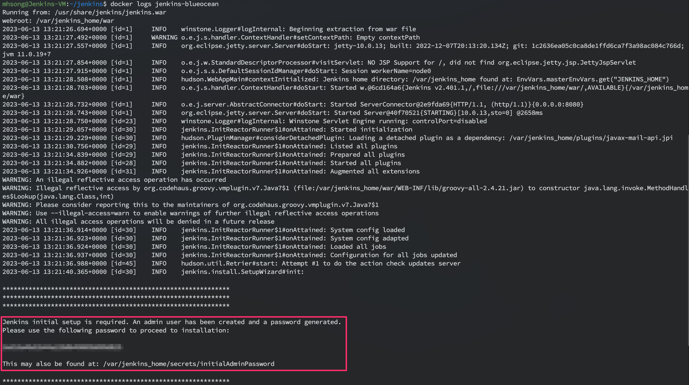

Jenkins를 사용한 CI 테스트 랩을 구성하기 위해서 Jenkins를 Docker 형태로 구성하며 삽질한 내용을 정리하였다. Jenkins는 Ubuntu(22.04 lts) VM 위에서 Docker로 기동하였고 공식 문서([Installing Jenkins - Docker](https://www.jenkins.io/doc/book/installing/docker/))를 참고하여 진행했다.

# Pre-requisites

최소사양
- 256 MB RAM
- 10 GB is a recommended minimum if running Jenkins as a Docker container

권장 사양
- 4 GB+ of RAM
- 50 GB+ of drive space

Software requirements
- [Java requirements](https://www.jenkins.io/doc/administration/requirements/java/)

# Dind container

공식 홈페이지에서 docker를 사용하는 Jenkins 설치 가이드 문서를 보면 dind image를 사용하는 container를 먼저 기동하고 jenkins container를 기동하는 순서로 가이드하고 있다.
dind container를 띄우는 방법에 대해서는 공식 문서에서 아래와 같은 docker command를 기술하고 있다.

- https://www.jenkins.io/doc/book/installing/docker/#on-macos-and-linux 의 2, 3

```bash
docker network create jenkins
docker run \
  --name jenkins-docker \
  --rm \
  --detach \
  --privileged \
  --network jenkins \
  --network-alias docker \
  --env DOCKER_TLS_CERTDIR=/certs \
  --volume jenkins-docker-certs:/certs/client \
  --volume jenkins-data:/var/jenkins_home \
  --publish 2376:2376 \
  docker:dind \
  --storage-driver overlay2
```

상기 command를 docker compose로 변경하면 아래와 같다.

```yaml
version: '3.8'
services:
  dind:
    container_name: jenkins-docker
    privileged: true
    networks:
      jenkins:
        aliases:
          - docker
    environment:
      - DOCKER_TLS_CERTDIR=/certs
    volumes:
      - jenkins-docker-certs:/certs/client:rw
      - jenkins-data:/var/jenkins_home:rw
    image: docker:dind
    command: --storage-driver=overlay2
    ports:
      - 2376:2376
    
volumes:
  jenkins-docker-certs:
    name: jenkins-docker-certs
  jenkins-data:
    name: jenkins-data

networks:
  jenkins:
    name: jenkins
    driver: bridge
```

위 docker compose 스크립트를 실행하면 아래와 같이 dind container가 정상적으로 기동된다.


# Jenkins container

dind container 기동 이 후 4번부터 Jenkins container에 대한 문서가 작성되어 있다. 해당 문서에서는 jenkins image를 베이스로 docker cli가 설치된 image를 생성하도록 가이드하고 있다. 

> The recommended Docker image to use is the Official `jenkins/jenkins` image (from the [Docker Hub repository](https://hub.docker.com/)). This image contains the current [Long-Term Support (LTS) release of Jenkins](https://www.jenkins.io/download/) (which is production-ready). However this image doesn’t have docker CLI inside it and is not bundled with frequently used Blue Ocean plugins and features. This means that if you want to use the full power of Jenkins and Docker you may want to go through described below installation process.

가이드 문서의 내용은 아래와 같다.

4. Customise official Jenkins Docker image, by executing below two steps:
    1. Create Dockerfile with the following content:
        
        ```docker
        FROM jenkins/jenkins:2.401.1
        USER root
        RUN apt-get update && apt-get install -y lsb-release
        RUN curl -fsSLo /usr/share/keyrings/docker-archive-keyring.asc \
          https://download.docker.com/linux/debian/gpg
        RUN echo "deb [arch=$(dpkg --print-architecture) \
          signed-by=/usr/share/keyrings/docker-archive-keyring.asc] \
          https://download.docker.com/linux/debian \
          $(lsb_release -cs) stable" > /etc/apt/sources.list.d/docker.list
        RUN apt-get update && apt-get install -y docker-ce-cli
        USER jenkins
        RUN jenkins-plugin-cli --plugins "blueocean docker-workflow"
        ```
        
    2. Build a new docker image from this Dockerfile and assign the image a meaningful name, e.g. "myjenkins-blueocean:2.401.1-1": `docker build -t myjenkins-blueocean:2.401.1-1 .`
5. Run your own `myjenkins-blueocean:2.401.1-1` image as a container in Docker using the following `[docker run](https://docs.docker.com/engine/reference/run/)` command:
    
    ```bash
    docker run \
      --name jenkins-blueocean \
      --restart=on-failure \
      --detach \
      --network jenkins \
      --env DOCKER_HOST=tcp://docker:2376 \
      --env DOCKER_CERT_PATH=/certs/client \
      --env DOCKER_TLS_VERIFY=1 \
      --publish 8080:8080 \
      --publish 50000:50000 \
      --volume jenkins-data:/var/jenkins_home \
      --volume jenkins-docker-certs:/certs/client:ro \
      myjenkins-blueocean:2.401.1-1
    ```

5번의 docker run 커맨드를 docker compose 형태로 변경하면 아래와 같다.

```yaml
services:
  jenkins:
    container_name: jenkins-blueocean
    environment:
      - DOCKER_HOST=tcp://docker:2376
      - DOCKER_CERT_PATH=/certs/client
      - DOCKER_TLS_VERIFY=1
    networks:
      - jenkins
    volumes:
      - jenkins-docker-certs:/certs/client:ro
      - jenkins-data:/var/jenkins_home:rw
    ports:
      - 8080:8080
      - 50000:50000
    image: myjenkins-blueocean:2.401.1-1
    deploy:
      restart_policy:
        condition: on-failure
```

dind container와 jenkins container를 하나의 yaml 파일로 정리하면 아래와 같다.

```yaml
version: '3.8'
services:
  dind:
    container_name: jenkins-dind
    privileged: true
    networks:
      jenkins:
        aliases:
        - docker
    environment:
      - DOCKER_TLS_CERTDIR=/certs
    volumes:
      - jenkins-docker-certs:/certs/client:rw
      - jenkins-data:/var/jenkins_home:rw
    image: docker:dind
    command: --storage-driver=overlay2
    ports:
      - 2376:2376
  jenkins:
    container_name: jenkins-controller
    environment:
      - DOCKER_HOST=tcp://docker:2376
      - DOCKER_CERT_PATH=/certs/client
      - DOCKER_TLS_VERIFY=1
    networks:
      - jenkins
    volumes:
      - jenkins-docker-certs:/certs/client:ro
      - jenkins-data:/var/jenkins_home:rw
    ports:
      - 8080:8080
      - 50000:50000
    image: myjenkins-blueocean:2.401.1-1
    deploy:
      restart_policy:
        condition: on-failure

volumes:
  jenkins-docker-certs:
    name: jenkins-docker-certs
  jenkins-data:
    name: jenkins-data

networks:
  jenkins:
    name: jenkins
    driver: bridge
```

# Jenkins 기본 설정

`docker compose up -d` command로 container를 기동한 후 VM의 공인 IP의 8080 포트로 접근하면 아래 화면처럼 Jenkins 초기 세팅을 진행할 수 있다.


administrator password는 jenkins controller(jenkins-blueocean) container의 `/var/jenkins_home/secrets/initialAdminPassword`에서 확인 가능하며 container의 로그에서도 확인할 수 있다.



administrator password를 입력해주면 plugin 설치 화면으로 넘어가는데, Install suggested plugins 으로 기본 추천되는 플러그인들을 설치하였다.


플러그인 설치가 완료되면 아래와 같이 계정 정보를 등록하게 된다.


이 후 Jenkins URL을 등록한다.


상기 작업까지 완료하게되면 Jenkins를 사용할 수 있게 된다.


# 왜 공식 가이드에서는 dind image를 사용하는 container를 띄울까?

앞서 살펴본 바와 같이 공식 홈페이지에서 docker를 사용하는 Jenkins 설치 가이드 문서를 보면 Jenkins container 외 dind image를 사용하는 container도 함께 띄우도록 가이드하고 있다. Jenkins container가 있는데 왜 dind container를 또 띄우라고 하는 것인지 궁금하여 검색해보니 Jenkins 커뮤니티에서 다음과 같은 글을 찾을 수 있었다.

- [What is the purpose of docker-in-docker when using a dockerized Jenkins?](https://community.jenkins.io/t/what-is-the-purpose-of-docker-in-docker-when-using-a-dockerized-jenkins/1370)

상기 글의 질문자도 나와 같은 의문을 갖고 있었던 것으로 보이는데, 해당 질문의 대답은 “The Docker in Docker container allows the Jenkins controller to run jobs inside Docker images.” 이다. 
Jenkins가 container 이미지를 빌드하기 위해서는 docker 명령어를 사용할 수 있어야 한다. Jenkins를 도커 위에서 기동한다면, 도커 container 안에서 도커 명령어를 사용할 수 있어야 한다. 이를 위해 dind container를 별도로 띄운다. 

dind container의 docker run parameter 살펴보면 `--network-alias docker` 과 `--publish 2376:2376` parameter가 있으며, jenkins container의 docker run parameter에는 environment에 `-- DOCKER_HOST=tcp://docker:2376` parameter가 있다. 

- 참고 블로그: [https://velog.io/@hsshin0602/Jenkins-파이프라인-jenkins-docker-통합](https://velog.io/@hsshin0602/Jenkins-%ED%8C%8C%EC%9D%B4%ED%94%84%EB%9D%BC%EC%9D%B8-jenkins-docker-%ED%86%B5%ED%95%A9)


이를 통해 Jenkins container에서 docker command를 실행하면 docker cli는 dind container의 2376 포트로 TCP 통신을 보내게 되며 docker command는 dind container에서 실행된다.

아래의 pipeline을 실행하면 maven image를 pulling하게 되는데 dind container에서 docker image list를 확인해보면 pulling한 image가 dind container 내부에 저장된 것을 확인할 수 있다.

**[jenkinsfile]**
```groovy
pipeline {
  agent {
    docker { image 'maven:3.9.3-eclipse-temurin-11' }
  }
  stages {
    stage('agent-test') {
      steps {
        sh 'mvn --version'
      }
    }
  }
}
```

**[dind container에서의 docker image list]**


## 문제점
공식 문서 가이드를 보면 privilieged 파라미터를 사용하는 것을 확인할 수 있다. 이는 큰 보안 위험을 초래할 수 있다.

- [https://aidanbae.github.io/code/docker/dinddood/](https://aidanbae.github.io/code/docker/dinddood/)
- [https://jpetazzo.github.io/2015/09/03/do-not-use-docker-in-docker-for-ci/](https://jpetazzo.github.io/2015/09/03/do-not-use-docker-in-docker-for-ci/)

dind 이미지의 도커 허브 페이지에는 일반적으로 권장되는 방법이 아니라고 표기되어 있다.

- [https://hub.docker.com/_/docker](https://hub.docker.com/_/docker)

# DinD & DooD

이러한 문제점으로 인해 DinD에 대응되는 DooD(Docker out of Docker)라는 개념이 생겼다.

DinD의 경우

- dind container 내에 host machine의 docker daemon과 별개의 docker daemon을 띄운다.
- jenkins controller가 docker cli를 실행하면 해당 command는 dind container에서 실행된다.


container image를 pulling하면 dind container에 container image가 저장되므로 host machine에서는 image를 확인할 수 없다.


DooD의 경우

- host machine의 `/var/run/docker.sock` 파일을 volume으로 mount한다.
- Jenkins controller container 내에서는 docker cli를 실행하면 mount된 `docker.sock` 파일을 통해 host machine의 docker daemon과 통신한다.
- container는 host machine에서 기동된다.


dood 방식의 jenkins controller container에서 `docker ps` command를 날려보면 아래와 같이 자기 자신인 jenkins controller container가 확인됨을 알 수 있다. 이는 host machine의 docker daemon과 통신하기 때문이다.


## DooD 방식의 구현

DooD 방식으로 Jenkins를 구동하기 위해 dockerfile을 수정했다. `docker.sock` 파일의 접근 권한은 아래와 같이 `root:docker`이며 docker group의 id 값은 999임을 확인했다.


container 내에 docker cli만 설치하면 docker group이 생성되지 않는다. 따라서 docker cli가 `docker.sock`에 접근할 때 permission 에러가 발생한다. 이 문제는 dockerfile에 `RUN groupadd -g 999 docker && usermod -aG docker jenkins` 라인을 추가함으로써 해결할 수 있다.

```docker
FROM jenkins/jenkins:2.401.1
USER root
RUN apt-get update && apt-get install -y lsb-release
RUN curl -fsSLo /usr/share/keyrings/docker-archive-keyring.asc \
  https://download.docker.com/linux/debian/gpg
RUN echo "deb [arch=$(dpkg --print-architecture) \
  signed-by=/usr/share/keyrings/docker-archive-keyring.asc] \
  https://download.docker.com/linux/debian \
  $(lsb_release -cs) stable" > /etc/apt/sources.list.d/docker.list
RUN apt-get update && apt-get install -y docker-ce-cli
RUN groupadd -g 999 docker && usermod -aG docker jenkins
USER jenkins
RUN jenkins-plugin-cli --plugins "blueocean docker-workflow"
```

이 후 docker-compose.yaml 파일에서 `/ver/run/docker.sock`를 아래와 같이 volume으로 mount 하였다.

```yaml
version: '3.8'
services:
  jenkins:
    container_name: jenkins-blueocean
    networks:
      - jenkins
    volumes:
      - jenkins-data:/var/jenkins_home:rw
      - /var/run/docker.sock:/var/run/docker.sock
    ports:
      - 8080:8080
      - 50000:50000
    image: myjenkins-blueocean:2.401.1-1
    deploy:
      restart_policy:
        condition: on-failure

volumes:
  jenkins-data:
    name: jenkins-data

networks:
  jenkins:
    name: jenkins
    driver: bridge
```

Jenkins controller 기동 후 dind와 동일하게 아래의 docker agent 방식으로 pipeline을 실행하면 빌드가 잘 동작함을 확인할 수 있다.

**[Pipeline]**

```groovy
pipeline {
  agent {
    docker { image 'maven:3.9.3-eclipse-temurin-11' }
  }
  stages {
    stage('agent-test') {
      steps {
        sh 'mvn --version'
      }
    }
  }
}
```

**[빌드 결과]**


해당 빌드 시 `maven:3.9.3-eclipse-temurin11` image를 pulling하게 되어 있다. dood 방식이 제대로 구현되었다면 아래와 같이 host machine에서 해당 image를 확인할 수 있다.

