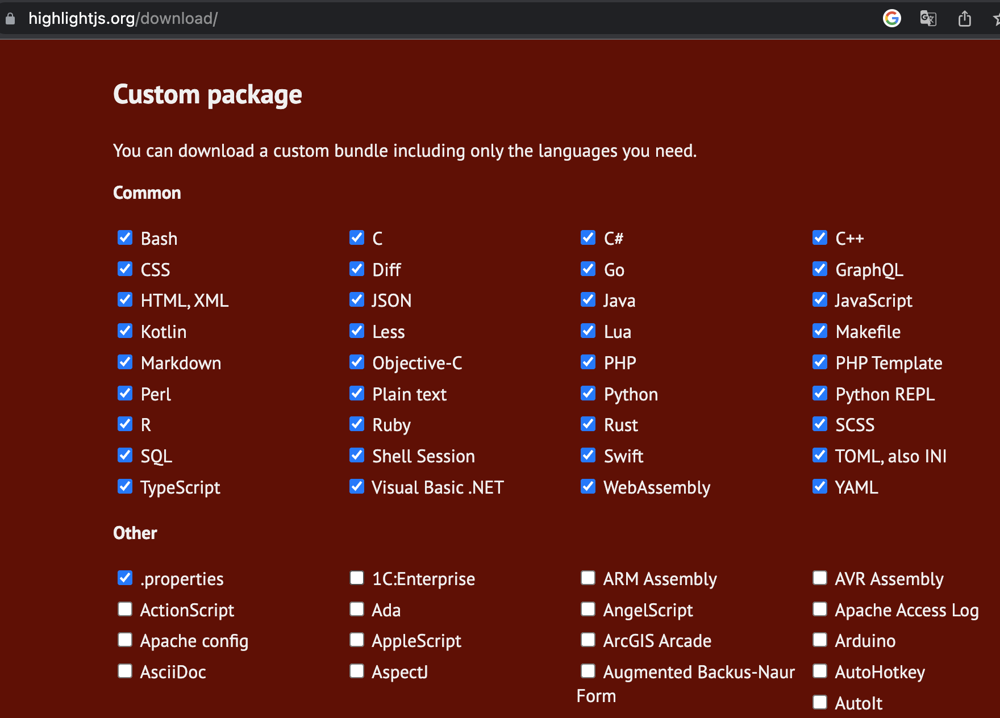
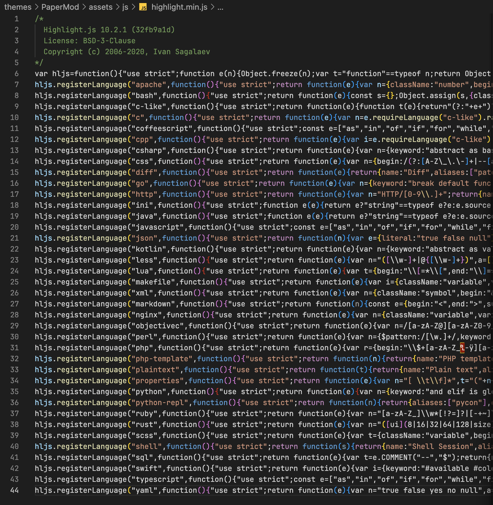
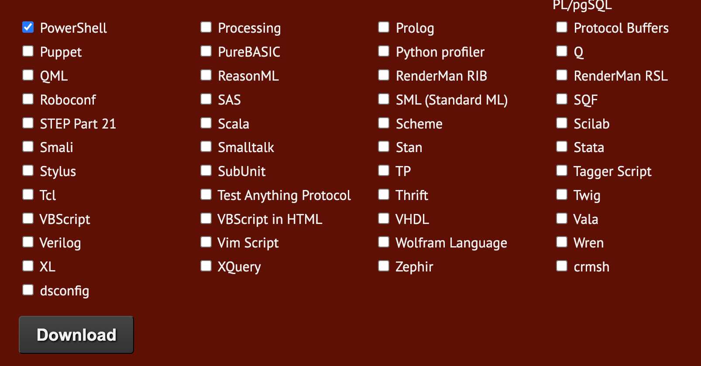
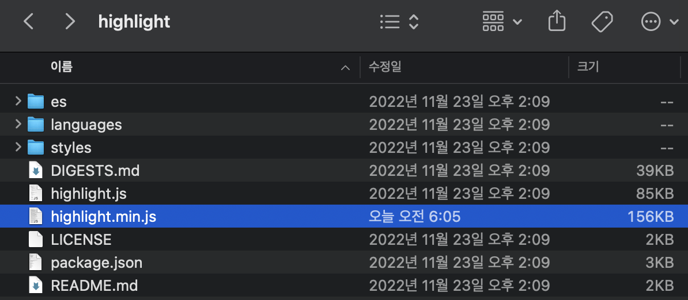
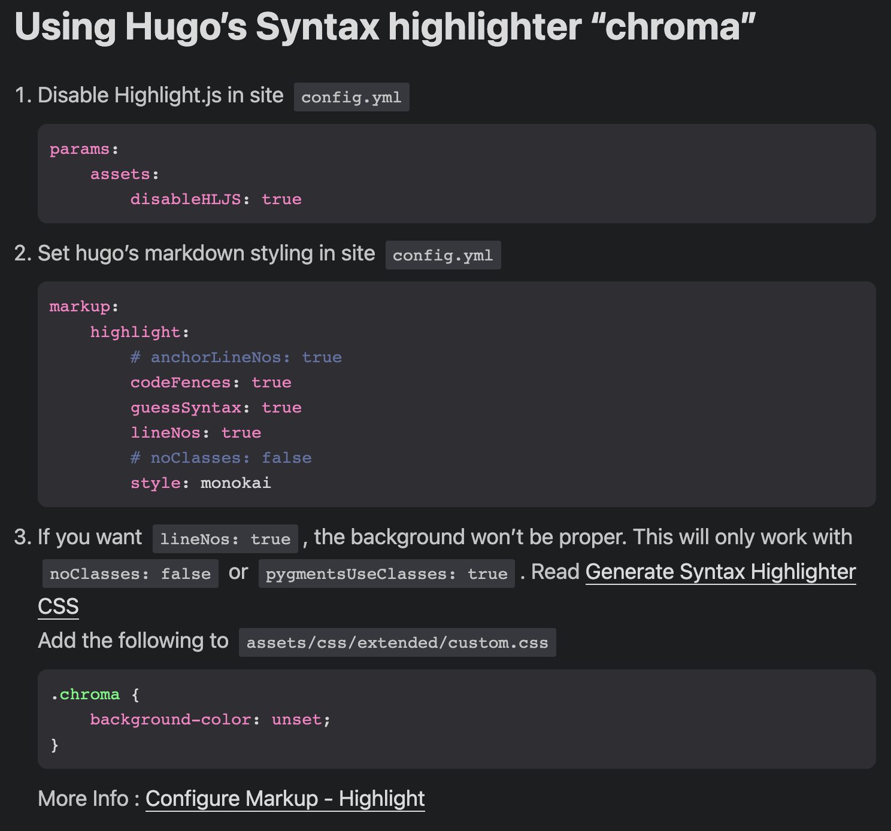

# 문제 상황

Hugo로 블로그를 만들기 위해서 여러 가지 테마를 찾던 중 PaperMod라는 테마가 깔끔해서 해당 테마를 사용하기로 결정했다. 기본 설정을 마치고 Syntax highlight 테스트를 진행하던 중 PowerShell에 대해서는 Syntax highlight가 적용되지 않는 것을 확인하였다. hugo는 기본적으로 chroma를 code highlighter로 사용하며 chroma에서는 PowerShell을 기본 지원한다. 다른 테마를 사용했을 때는 PowerShell이 지원되는 것을 확인하였다.

- [Chroma : Supported language](https://github.com/alecthomas/chroma#supported-languages)

# 원인

이 현상의 원인은 PaperMod가 기본 Code highlighter로 `highlight.js`를 사용하기 때문이다. `highlight.js`는 code highlighting을 적용하고자 하는 언어를 체크해서 해당 언어들만 highlighting이 가능하게 한다. 



PaperMod는 `highlight.js`에서 지원하는 모든 언어를 지원하지는 않고 전체 언어 중 38개만 체크해서 적용한 것으로 보인다.

- `themes/PaperMod/assets/js/highlight.min.js`

    

# 해결 방법

## `highlight.js` 파일에 PowerShell 추가

첫번째로 [highlightjs.org/download/](https://highlightjs.org/download/) 페이지에서 PowerShell을 체크해서 `highlight.js` 파일을 다시 다운로드 받아 적용하는 방법이 있다.



다운로드 버튼을 클릭하면 `highlight.zip` 파일을 다운로드하게 된다. 압축을 풀면 아래와 같은 파일과 폴더들이 나오는데 그 중 `highlight.min.js` 파일을 `theme/PaperMod/assets/js/highlight.min.js` 파일에 덮어쓰면 된다.



## Chroma 사용

앞에서 hugo는 code highlighter로 chroma를 기본 지원한다고 언급하였다. Chroma는 PowerShell 뿐만 아니라 Terraform도 지원한다. 이에 반해 `highlight.js`는 Terraform을 지원하지 않는다. Terraform에 대한 포스트도 블로그에 올릴 계획이었던 나로서는 기본 chroma를 적용하는 것이 더 나은 선택지이다.

PaperMod에서는 `highlight.js`를 disable하고 chroma를 적용하는 기능도 지원하고 있다.

- https://adityatelange.github.io/hugo-PaperMod/posts/papermod/papermod-faq/#using-hugos-syntax-highlighter-chroma

    

toml 형식으로 변경하면 아래와 같다.

```toml
[params.assets]
disableHLJS = true

[markup.highlight]
# anchorLineNos: true
codeFences = true
guessSyntax = true
lineNos = true
style = "base16-snazzy"
# style = "monokai"
```
